

## Отчет

## Практическая работа 2 [HomeP]

## Основы XML-разметки. Менеджеры размещения LinearLayout и GridLayout

---

**ФИО:** Лапшин Никита Евгеньевич  
**Курс:** 2
**Группа:** ИНС-б-о-24-1  
**Направление:** 09.03.02 «Информационные системы и технологии»  

---
### Вариант 9
### Цель работы

Изучить основы языка разметки XML для описания пользовательского интерфейса Android-приложений. Научиться использовать менеджеры размещения (контейнеры) LinearLayout и GridLayout для создания сложных экранов. Освоить основные атрибуты View и создание простых Drawable-ресурсов.

### Ход работы

## Задание 1: Создание проекта и верстка экрана

  
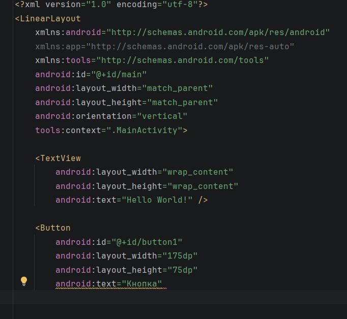

Рисунок 1 - Структура XML-файла

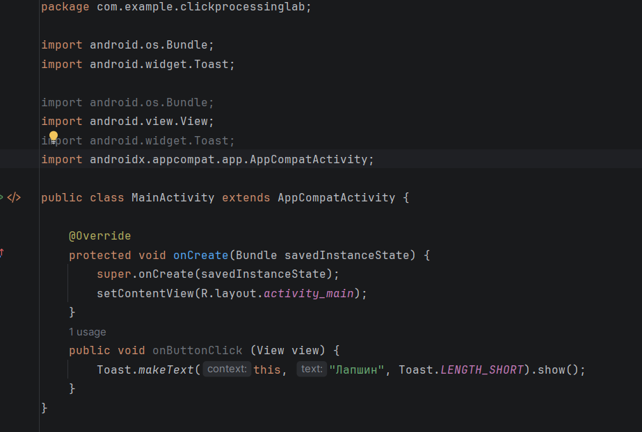

Рисунок 2 - Всплывающее сообщение с фамилией студента

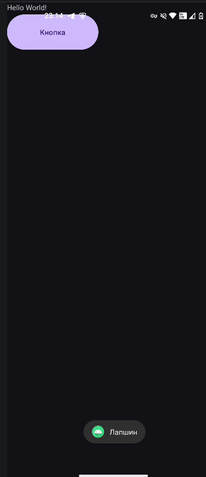

Рисунок 3 – Демонстрация кода

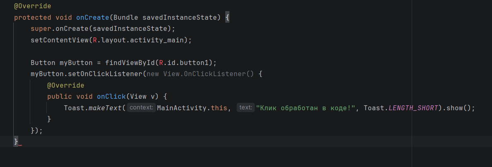

Рисунок 4 – Использование аргумента View для изменения нажатой кнопки

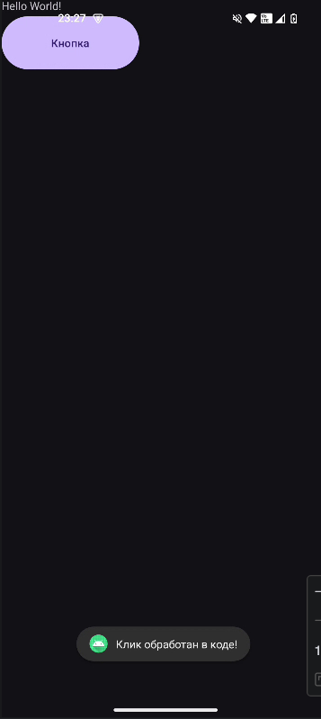

Рисунок 5 – 

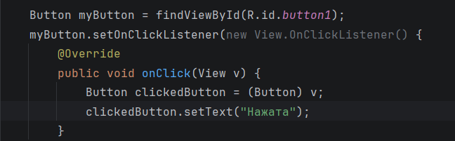

Рисунок 6 – 

Рисунок 7 – 

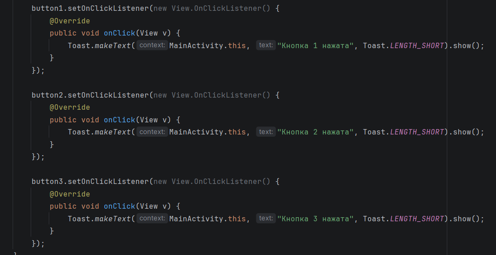

Рисунок 8 – 

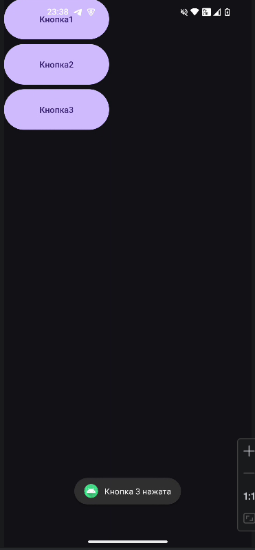

Рисунок 9 – 

Рисунок 10 – 

Рисунок 11 –

Рисунок 12 –

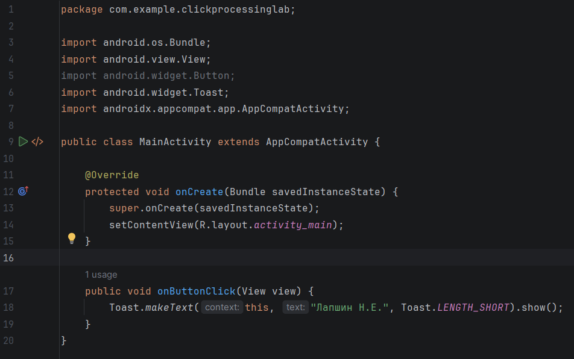

Рисунок 13 –

Рисунок 14 – 

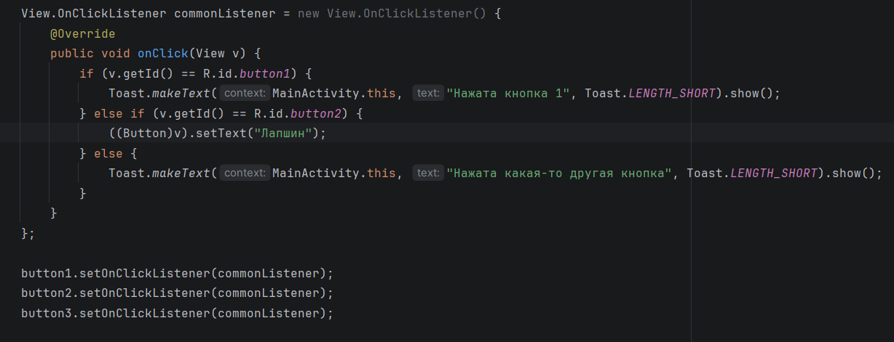

Рисунок 15 – 

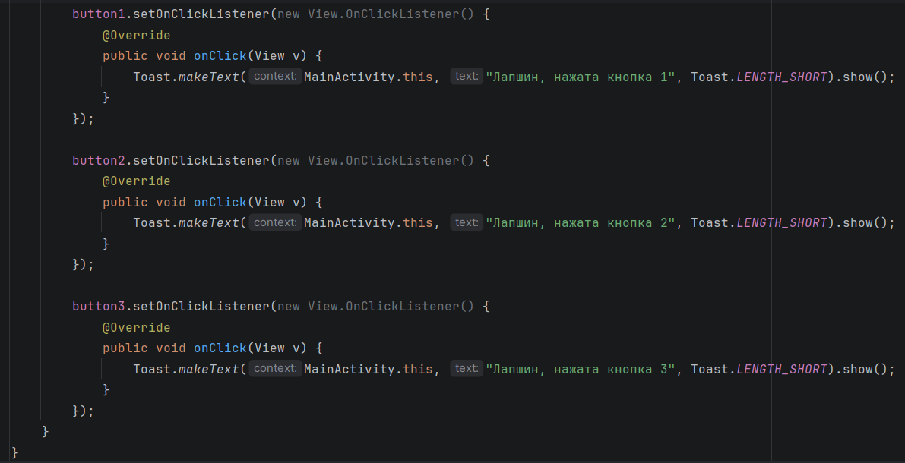

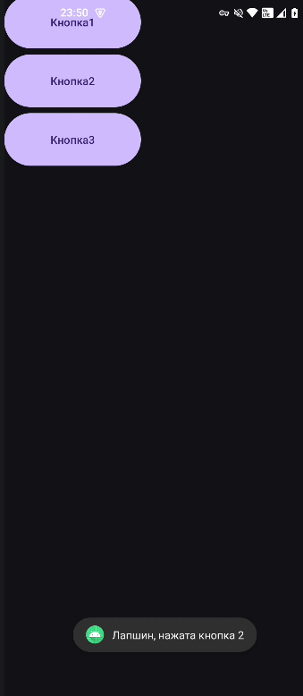

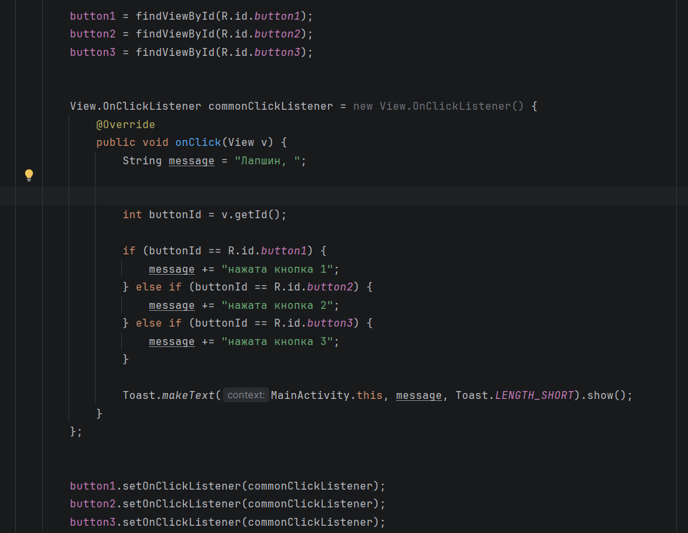

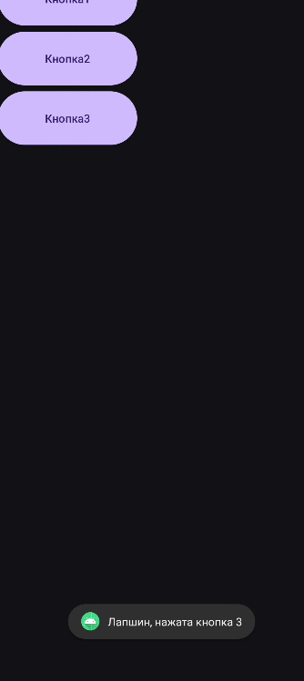

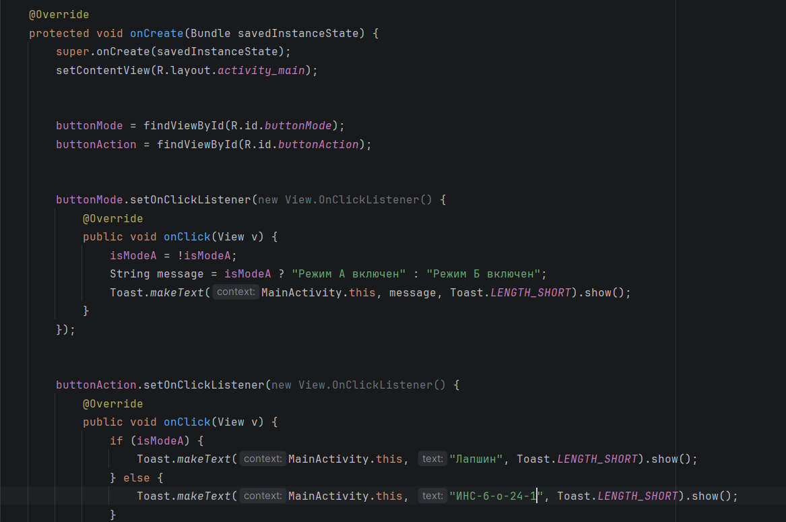

